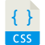

# Bienvenue 👋

🧑‍💻 Ce portfolio présente une sélection de mes projets, outils maîtrisés (comme Cypress, Jira, Playwright, Postman) et approches de test, illustrant ma capacité à assurer la fiabilité, la sécurité et la performance des applications. Mon parcours m'a permis de travailler dans des environnements variés, agiles et exigeants, où j'ai développé une rigueur méthodique, un esprit d'analyse aigu et une forte capacité à identifier les anomalies pour garantir une expérience utilisateur optimale.

Bonne visite ! 😄

## 🤖 Automation Projects

### ⚙️ API Testing

- <u>[To-do list app - Postman](https://github.com/qa-portfolio/projet-todo-list-api)</u>
- <u>[Product management app - Postman](https://github.com/qa-portfolio/api-academind)</u>

### 🎞️ E2E & UI Testing

- <u>[To-do List - BDD / Gherkin - Cypress](https://github.com/allanRolle/todo-list-cypress-test-ui)</u>
- <u>[To-do List - BDD / Gherkin - Playwright](https://github.com/allanRolle/todo-list-playwright-tests-ui)</u>

## 📝 Mémento

- <u>[A list of questions / answers to prepare for interviews](https://github.com/allanRolle/qa-memento)</u>

## 🛠 Stack technique

    
    
    
    
    
    
    
    
    
    
    
    
    
    
    
    
    
    

## 📜 Certifications

- <u>🎓 [Certification ISTQB Foundation](https://app.skillsclub.com/credential/282700-82c18dc359baec985ceda36795c16de20fe98e2876cad0625593b4cdbe638b8a)</u>
- <u>🎓 [Certification ISTQB Generative AI](https://app.skillsclub.com/credential/291505-e605701d815e5be1f2e4e630e8d2f7e77fb1aae64486475454fc1f8d4a0cd8a3)</u>
- <u>🎓 [Postman API Fundamentals Student Expert](https://badges.parchment.com/public/assertions/snpQmpKDSMany-wy1zeHtw?identity__email=allan.chris.rolle@gmail.com)</u>

## 📩 Contact

- LinkedIn: [@allan-rolle](https://www.linkedin.com/in/allan-rolle/)
- Email: <a href="mailto:allan.rolle@laposte.net">allan.rolle@laposte.net
